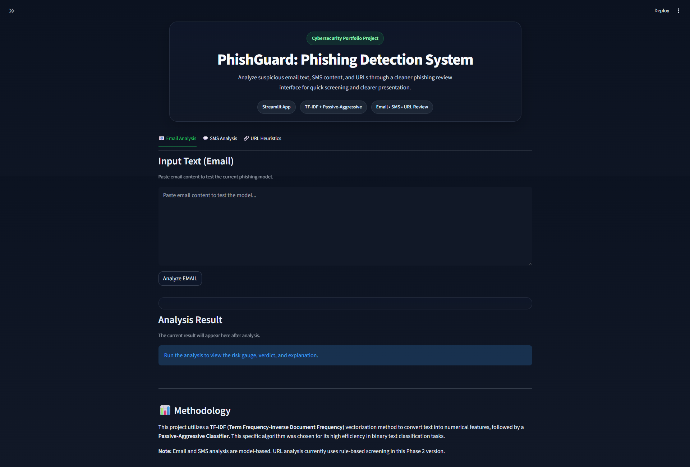
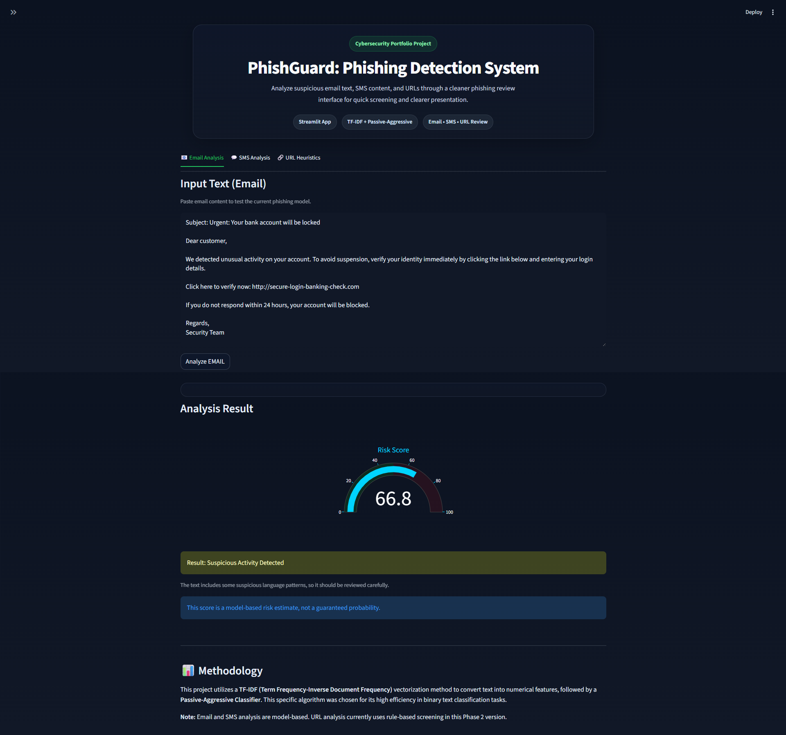
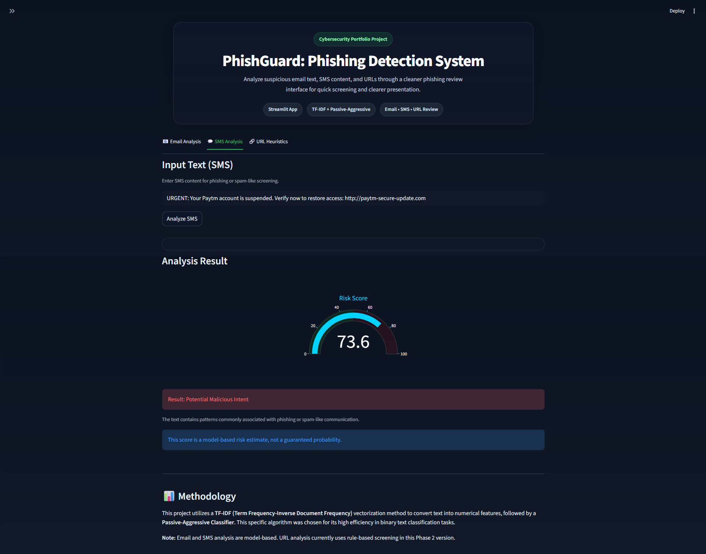
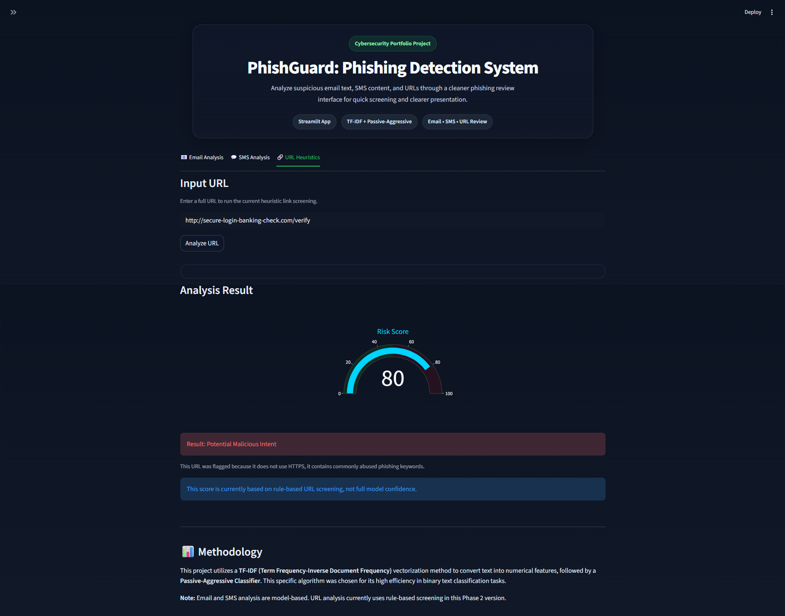
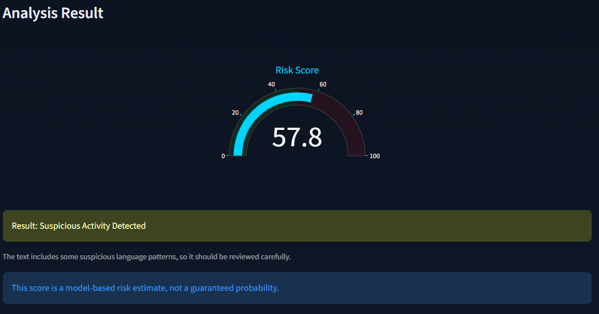

# PhishGuard

PhishGuard is a Streamlit-based phishing detection app that helps users assess whether an **Email**, **SMS**, or **URL** may be suspicious. It is designed as a trust-first cybersecurity demo that combines machine learning prediction with clearer verdicts, cleaner UI, and safer user guidance.

## Live Demo

[Live App](https://phishguard-pyuqhxgtkew9xefue6xbnb.streamlit.app/)

## Preview



## Why this project exists

Phishing attacks continue to target users through fake emails, scam messages, and malicious links. PhishGuard was built to provide a simple and beginner-friendly way to review suspicious content and get a quick risk assessment through an accessible web interface.

This V2 rebuild improves the earlier prototype by focusing on:

- better validation and safer input handling
- clearer trust messaging and result readability
- improved project structure and maintainability
- a cleaner, more professional Streamlit interface
- stronger portfolio/demo presentation

## Features

- Email phishing analysis
- SMS scam/phishing analysis
- URL risk analysis
- Trust-focused result presentation
- Validation for empty or invalid input
- Cleaner visual hierarchy and user flow
- Streamlit-based deployable web interface

## Screenshots

### Home Dashboard


### Email Analysis



### SMS Analysis



### URL Analysis



### Trust-Focused Result Card



## Tech Stack

- Python
- Streamlit
- scikit-learn
- Pickle / trained model file
- Git & GitHub
- Streamlit deployment

## Project Structure

```text
PhishGuard/
├── app.py
├── train.py
├── phishguard_model.pkl
├── requirements.txt
├── README.md
├── .gitignore
├── .streamlit/
│   └── config.toml
└── screenshots/
    ├── home-dashboard.png
    ├── email-analysis.png
    ├── sms-analysis.png
    ├── url-analysis.png
    └── trust-result-card.png
```

## How It Works

1. Open the app and choose the relevant input type: **Email**, **SMS**, or **URL**.
2. Paste the suspicious content into the appropriate field.
3. The app validates the input before processing.
4. The model and supporting logic analyze the content.
5. PhishGuard returns a verdict with a clearer presentation of the result.

## Installation

Clone the repository:

```bash
git clone https://github.com/aryanParth-afk/PhishGuard.git
cd PhishGuard
```

Install dependencies:

```bash
pip install -r requirements.txt
```

Run the app locally:

```bash
streamlit run app.py
```

## Usage

- Use the **Email** tab to check suspicious email text.
- Use the **SMS** tab to inspect scam-like messages.
- Use the **URL** tab to evaluate whether a link may be risky.
- Review the verdict and explanation carefully before deciding whether content is safe.

## V2 Improvements

This version focuses on turning the original project into a cleaner and more portfolio-ready application.

### Phase 1

- improved validation behavior
- stronger warning and trust messaging
- safer handling of weak or empty input

### Phase 2

- cleaner structure and maintainability improvements
- better separation of concerns
- improved code organization for future updates

### Phase 3

- professional Streamlit UI redesign
- improved layout hierarchy and readability
- better sidebar and header presentation
- stronger trust-first result display

## Example Use Cases

- Reviewing a suspicious email before clicking a link
- Checking whether an SMS message looks scam-like
- Evaluating an unfamiliar URL before opening it
- Demonstrating a student cybersecurity project in interviews, showcases, or college reviews

## Limitations

- This project is intended as an educational and demo-focused cybersecurity application.
- The output should be treated as a supportive signal, not a final security decision.
- Real-world phishing detection can require more context, larger datasets, and broader threat intelligence.

## Future Improvements

- richer phishing indicator explanations
- confidence visualization improvements
- expanded dataset and retraining workflow
- report export or downloadable summary
- browser extension or API version
- improved logging and analytics

## Author

**Aryan Parth**

- GitHub: [aryanParth-afk](https://github.com/aryanParth-afk)

## License

Add a license here if you want the project to be openly reusable, for example MIT.
